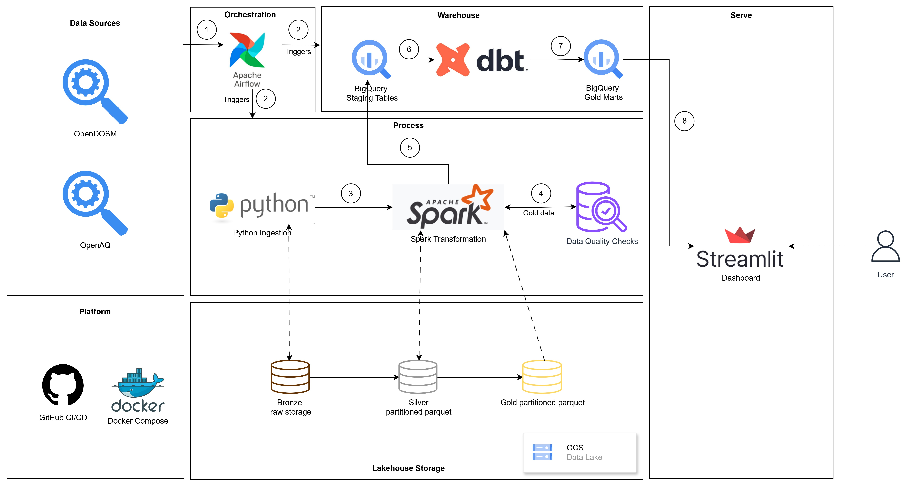

# MyAirWatch: Malaysia Air Quality Data Platform

A small lakehouse-style pipeline for Malaysia air quality analytics using OpenDOSM + OpenAQ , Local PySpark, GCS data, BigQuery Sandbox, Streamlit dashboard

## Overview

**Business Problem**: Industrialisation releases harmful particles that pollutes the air. Air quality across states per time window is non-trivial because data needs to be consistent, structured, and up-to-date for business-related analytics.

**Aim**: To develop a data lakehouse to store raw air quality data from OpenDOSM and OpenAQ, transform it into a form that creates value, stores it in a data lakehouse, and serve it to health authorities for implementation of effective frameworks.

**SDG Alignment**:

* SDG 3 — Good Health & Well-being
* SDG 11 — Sustainable Cities
* SDG 13 — Climate Action

## Architecture

### System Design

The system architecture of MyAirWatch is presented as follows:



***Medallion Architecture***
*Bronze Layer*

*Purpose*:

* store raw ingested data
* preserve source fidelity
* maintain lineage

*Format*:

* raw JSON/CSV/API outputs

*Storage*:

* local bronze storage
* GCS bronze bucket
* Silver Layer

*Purpose*:

* standardized analytical-ready data

***Transformations***:

* timestamp normalization
* schema standardization
* pollutant normalization
* deduplication
* state normalization
* null handling

*Format*:

* partitioned parquet

*Partitioning strategy*:

* year=YYYY/month=MM/day=DD/

\
***Gold Layer***

*Purpose*:

* business-ready analytical datasets

*Examples*:

* state monthly pollution summary
* pollutant health risk summary
* haze trend analysis

**Components**:

* Orchestration Layer   : Orchestrates events such as ingestion and warehouse serving.
* Ingestion Layer       : Extracts raw data from OpenDOSM and OpenDQ via API calling
* Bronze Layer          : Stores extracted raw data into Google File Storage (GFS) and local disk storage.
* Transformation Layer  : Performs data wrangling, applies transformations and aggregates raw data using PySpark Transformation Engine.
* Silver Layer          : Stores cleaned, structured data into local disk storage as partitioned parquet.
* Gold Layer            : Stores business-relevant data into local disk storage as partitioned parquet.

### Logical Design

***Logical Schema***

### Big Picture

```text
airflow/        → orchestration layers
data/           → storage layers
docs/           → knowledge layers
dbt_myairwatch/ → warehousing layer
media/          → media layer
notebooks/      → exploration layer
src/            → engineering layer
streamlit_app/  → presentation layer
sql/            → warehouse logic
```

### Repository Structure

```text
myairwatch/
├── airflow/
├── dbt_myairwatch/
├── data/
│   ├── bronze/
│   ├── silver/
│   └── gold/
├── docs/
├── notebooks/
├── src/
│   ├── extract/
│   ├── transform/
│   ├── load/
│   ├── quality/
│   └── utils/
├── streamlit_app/
├── sql/
├── requirements.txt
├── docker-compose.yml
└── README.md
```

## Tech stack

| Component            | Technology           |
| -------------------- | -------------------- |
| Orchestration        | Apache Airflow       |
| Processing Engine    | PySpark              |
| Storage Format       | Parquet              |
| Cloud Storage        | Google Cloud Storage |
| Data Warehouse       | BigQuery Sandbox     |
| Warehouse Modeling   | dbt                  |
| Dashboard            | Streamlit            |
| Programming Language | Python               |
| Version Control      | Git + GitHub         |
| Containerization     | Docker Compose       |

## Pipeline stages

## How to run

## Example outputs

## Screenshots

## Learnings
